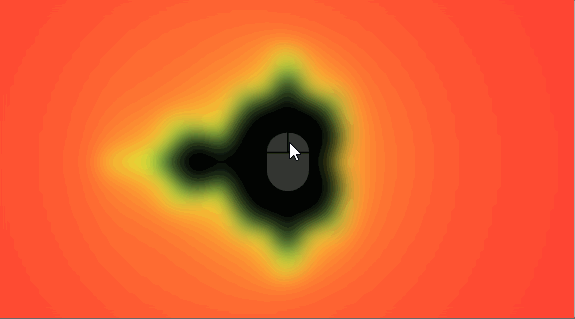

 
  

# mandelbrot-explorer

> A silly little React application to navigate the Mandelbrot set.

The application is hosted on GitHub pages here: http://brissons.github.io/mandelbrot-app.

Note: The [downstream server](https://github.com/brissons/mandelbrot-server) is hosted for free on Heroku. The application will be slow to load when used for the first time.

## Built with
* [React](https://reactjs.org/) - User Interface
  * [react-spinners-kit](https://www.npmjs.com/package/react-spinners-kit) - Loading Spinners
  * [react-textfit](https://www.npmjs.com/package/react-textfit) - Dyanmic text sizing
* [npm](https://www.npmjs.com/) - Package Manager
* [Icons8](https://icons8.com/) - Icons
